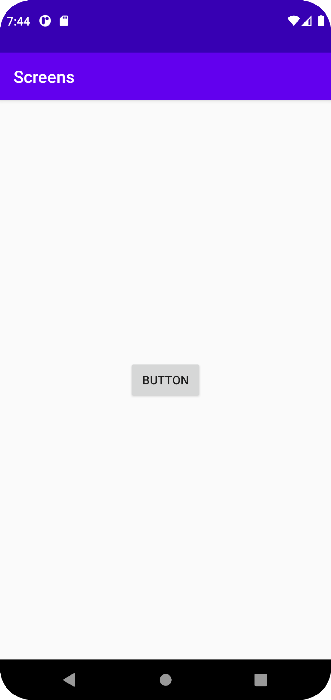
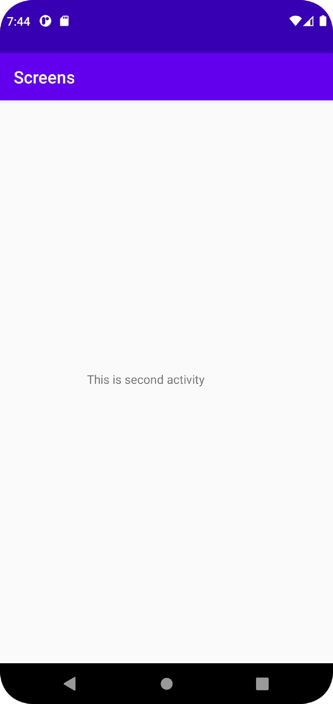

# Rapport

**Raman Mohammed - Rapport**

The project started with adding a button in **activity_secound.xml**. Button got id button and no changes were made, just adding constraints to button.
The next step was adding a new activity, after implementing a second activity. There was dependencies problem with the `Material.1.5`, thats why I had to change it from **1.5** to **1.4**.
Once the problem was fixed i started with calling the object button in **MainActivity**. Thereafter i had to implement a button listener for once the button is clicked it will redirect to a method. 


```
     button = findViewById(R.id.button);
        button.setOnClickListener(new View.OnClickListener() {
            @Override
            public void onClick(View view) {
                onClickButton();
            }
        });
```

The method **onClickButton();** had intents, which the purpose of intent is to carry data and launch it. There will also be a toast popup with the message `Second activity`.
```
    private void onClickButton() {
        Toast.makeText(this, "Second Activity", Toast.LENGTH_LONG).show();
        Log.d("SecoundActivity", "onClickButton: ");
        Intent intent = new Intent(MainActivity.this, SecoundActivity.class);
        intent.putExtra("name", "Raman"); 
        startActivity(intent);
    }

```
I also implemented a small text in **activity_second.xml** showing that this is second activity page.
I forgot to add extras in mainactivity also secondactivivity. I added 
`intent.putExtra("name", "Raman"); `
to **MainActivity**. Also i added `  Bundle extras = getIntent().getExtras();
if(extras != null) {
String name = extras.getString("name");
}` to **SecondActivity**




